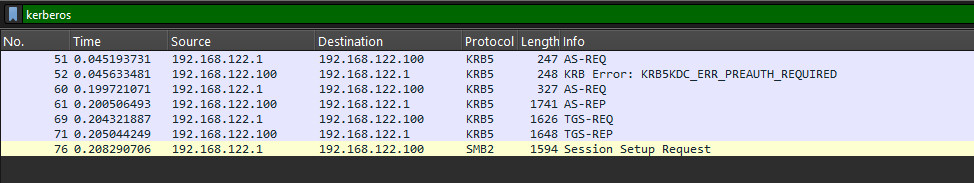
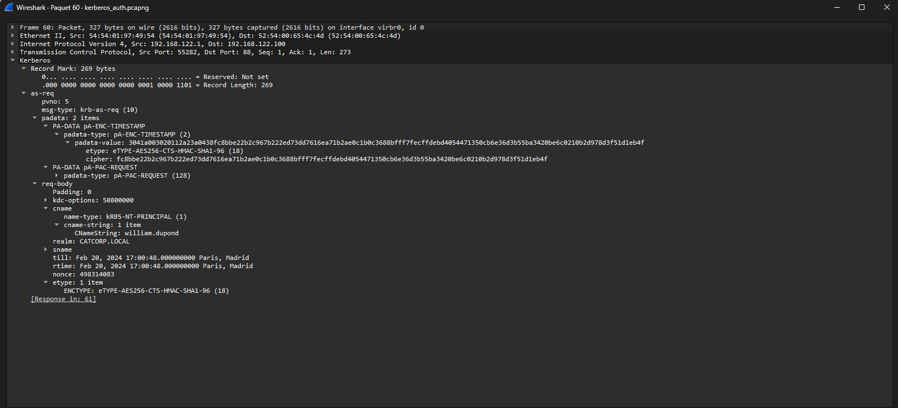

# Kerberos - Authentication

## Statement :

You have been asked by Cat Corporation's SOC team to retrieve a user's password linked to a suspicious Kerberos connection.

Flag format : `RM{userPrincipalName:password}`

* The userPrincipalName must be written in lowercase.

## Analysis

We open the .pcap file provided with the challenge in Wireshark and filter by `kerberos`.



Among the captured packets, the `AS-REQ` (Authentication Service Request) is the one we want. This is the initial request a client sends to the KDC to authenticate, it contains a pre-authentication encrypted timestamp that we can attempt to crack offline.



Expanding the packet, we extract the following fields:

- CNameString: `william.dupond`
- realm: `CATCORP.LOCAL`
- etype: `eTYPE-AES256-CTS-HMAC-SHA1-96 (18)`
- cipher: `fc8bbe22b2c967b222ed73dd7616ea71b2ae0c1b0c3688bfff7fecffdebd4054471350cb6e36d3b55ba3420be6c0210b2d978d3f51d1eb4f`

These fields are needed to reconstruct the Kerberos pre-authentication hash. The format expected by hashcat is:

```
$krb5pa$<etype>$<username>$<realm>$<cipher>
```

The etype also determines which hashcat mode to use:

| etype | hashcat mode |
|-------|-------------|
| 23    | 7500        |
| 17    | 19800       |
| 18    | 19900       |

## Exploit

We assemble the hash and save it to a file:

```
$krb5pa$18$william.dupond$CATCORP.LOCAL$fc8bbe22b2c967b222ed73dd7616ea71b2ae0c1b0c3688bfff7fecffdebd4054471350cb6e36d3b55ba3420be6c0210b2d978d3f51d1eb4f
```

Since the etype is 18, we use hashcat mode 19900:

```bash
hashcat -m 19900 krb_hash.txt /usr/share/wordlists/rockyou.txt
```

The password is cracked: `**********`

```
$krb5pa$18$william.dupond$CATCORP.LOCAL$fc8bbe22b2c967b222ed73dd7616ea71b2ae0c1b0c3688bfff7fecffdebd4054471350cb6e36d3b55ba3420be6c0210b2d978d3f51d1eb4f:**********
```

A Kerberos userPrincipalName is constructed as `username@domain`, giving us the flag:

`RM{william.dupond@catcorp.local:**********}`
