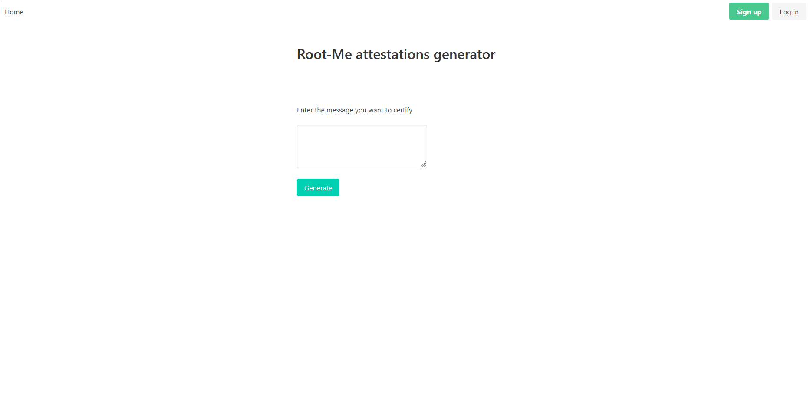
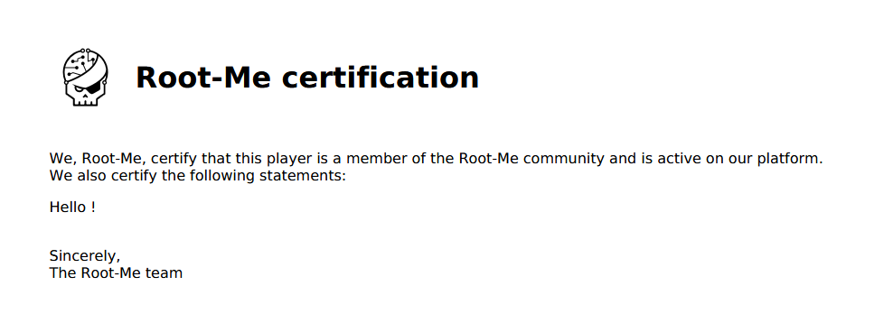
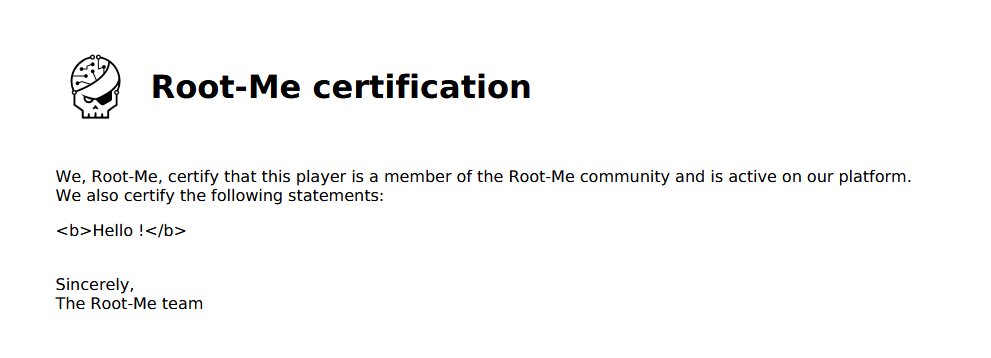
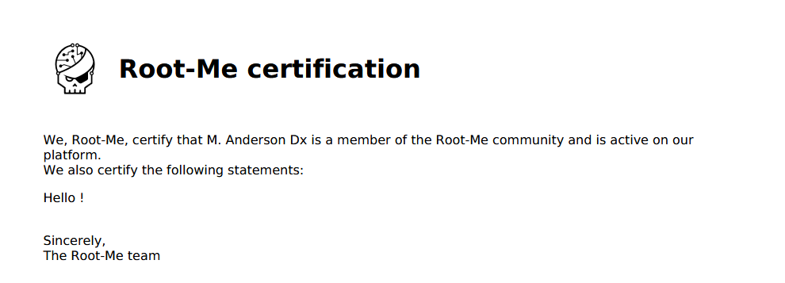
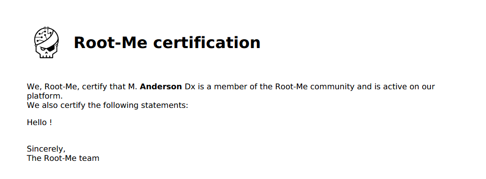

# XSS - Server Side

Statement : 

This platform for issuing certificates of participation has just gone live. The developers assure you that they have followed best practices and escaped all user inputs before using them in their code...

The flag is located in the `/flag.txt` file.

## Analysis

The website is an attestation generator: you enter a message and it produces a signed PDF from Root-Me.





This is a classic PDF generator vulnerability, if user input isn't properly sanitized before being rendered into the PDF, we can inject HTML/JS that gets executed server-side.

Let's start by injecting `<b>test</b>` into the message field to check if inputs are escaped.



The tags are rendered as plain text, so this input is properly escaped.

## Finding an injection point

Let's explore other functionalities. The site has Log in and Sign up pages. When registering, it asks for:

- Login
- First Name
- Last Name
- Password

After signing up and generating a new PDF, the first and last names appear in the certificate. This is a different input path, maybe the name fields aren't sanitized the same way.



I created a new account with `<b>Anderson</b>` as the first name.



It works, the first name is rendered as bold. The name fields are not escaped before being injected into the PDF template.

## Exploit

Now we need to leverage this to read `/flag.txt`. Here is the payload, used as the first name during registration:

```html
<svg onload="var xhr =
      new XMLHttpRequest(); xhr.open('GET', '/flag.txt', false); xhr.send();
      document.write(xhr.responseText);">
```

This `<svg>` tag executes JavaScript that performs a synchronous `XMLHttpRequest` to read `/flag.txt` and writes the content into the document.

After registering with this payload and generating a new certificate, the flag appears in the PDF.